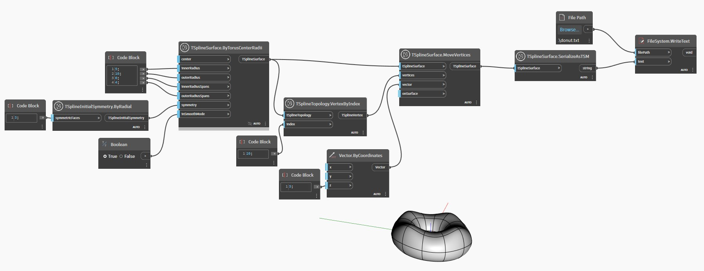

<!--- Autodesk.DesignScript.Geometry.TSpline.TSplineSurface.SerializeAsTSM --->
<!--- HPPPUZ44WSFE77XKRGFZMFM4FVPCIAERWGT6OF6U3ECKGKVBF3FA --->
## 상세
아래 예에서는 단순한 T-Spline 표면이 `TSplineSurface.SerializeAsTSM` 노드를 사용하여 문자열 TSM 형식으로 변환되고 텍스트 파일로 내보내집니다. 이 파일은 나중에 `TSplineSurface.DeserializeFromTSM` 노드를 사용하여 재구성할 수 있습니다.
___
## 예제 파일

