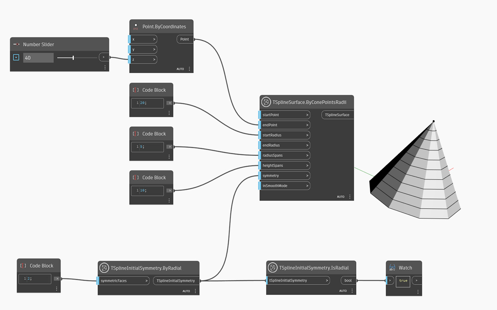

<!--- Autodesk.DesignScript.Geometry.TSpline.TSplineInitialSymmetry.IsRadial --->
<!--- KB37RARA32V2WDFDQAYZ4ZFBA3AOPWGQNDOAMYU4G6VXI5W6TR3Q --->
## In-Depth
아래 예에서는 `TSplineInitialSymmetry.IsRadial` 노드가 T-Spline 표면에 적용된 초기 대칭이 방사형 대칭인지 확인합니다. 노드가 False를 반환하면 대칭은 축 유형입니다.

## 예제 파일

