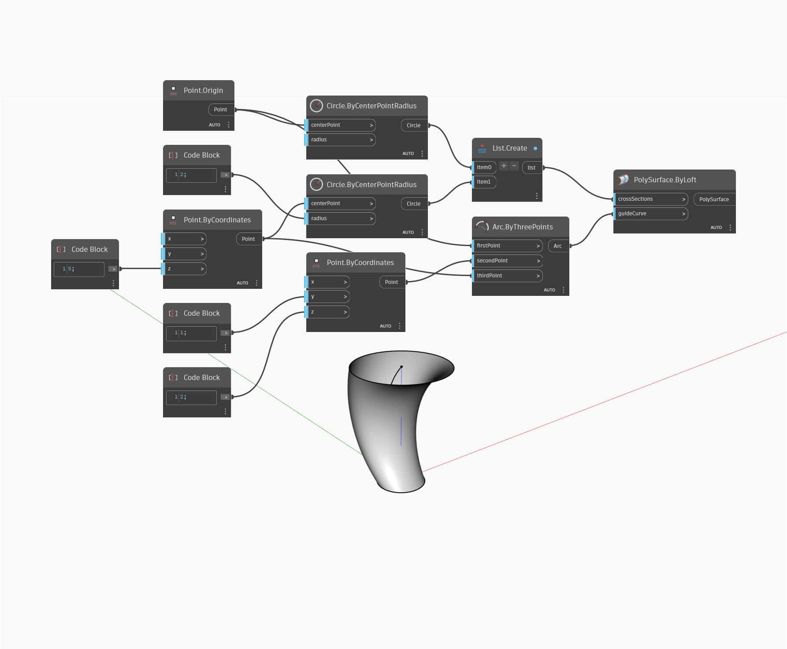

<!--- Autodesk.DesignScript.Geometry.PolySurface.ByLoft(crossSections, guideCurve) --->
<!--- KMSTMOWKW27MXHCUOIX46TZTXOOZLNUKTB4PHKIEB7ZYDANXLSFQ --->
## 상세
ByLoft(crossSections, guideCurve)는 리스트의 곡선과 안내 곡선 사이에서 로프트하여 새 PolySurface를 반환합니다. 아래 예에서는 두 원 사이에서 로프트하여 새 PolySurface를 반환합니다. 반환된 PolySurface는 guideCurve 입력의 호를 조정하여 왜곡됩니다.
___
## 예제 파일

