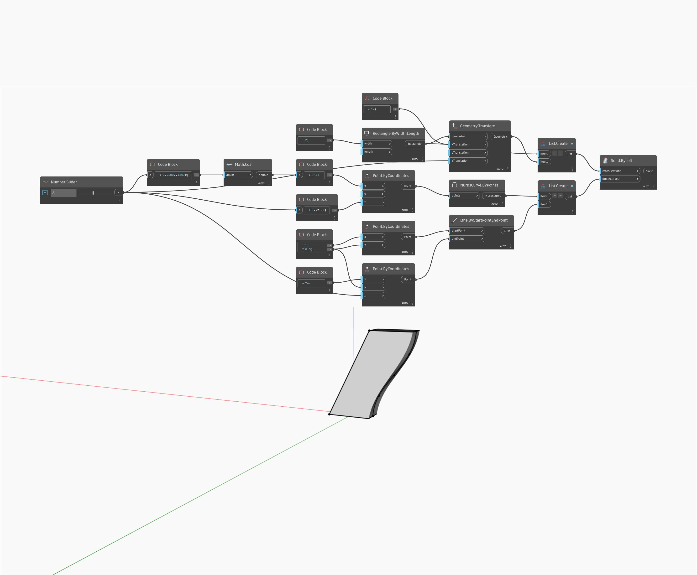

<!--- Autodesk.DesignScript.Geometry.Solid.ByLoft(crossSections, guideCurves) --->
<!--- L2FVRQ5TN5PVLYNQW2GAMUC7ERMJJMQS7TSOYXVL75IED5KQPCPQ --->
## 상세
`Solid.ByLoft (crossSections, guideCurves)`를 사용하면 안내 곡선 리스트를 입력하여 로프트 솔리드의 둘레를 따라 다양한 프로파일을 만들 수 있습니다.

아래 예에서는 두 개의 간격띄우기 직사각형을 `crossSections`로 사용합니다. 둘레에 서로 다른 두 개의 안내 곡선이 생성되는데, 하나는 코사인 함수를 기반으로 하고 다른 하나는 단순한 선을 기반으로 합니다.

___
## 예제 파일

