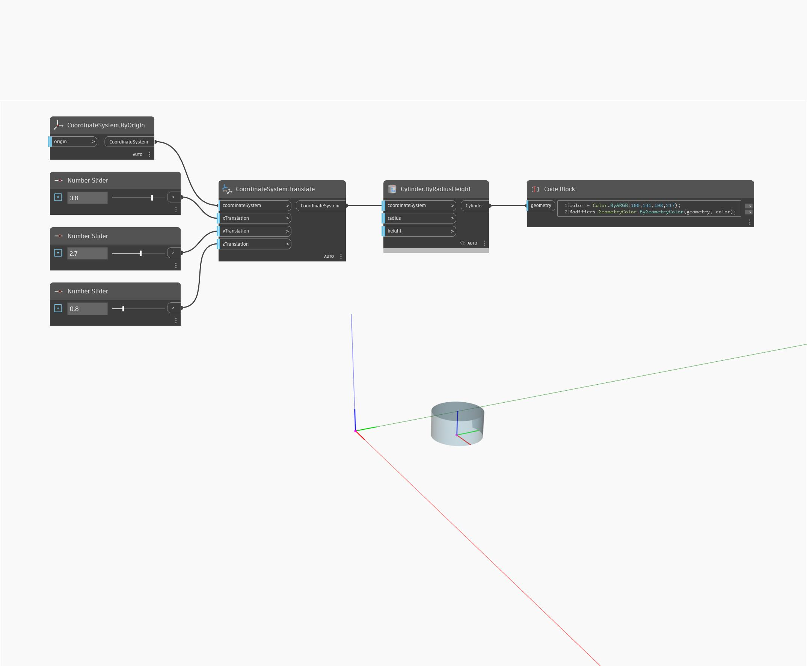

<!--- Autodesk.DesignScript.Geometry.CoordinateSystem.Translate(xTranslation, yTranslation, zTranslation) --->
<!--- LXHMBBFA4YF6O3K3SV762F2NW7HY7GGYBRPHPN2EE74TG2W5NM4A --->
## 상세
지정된 CoordinateSystem을 각각 WCS에 정의된 x, y, z 방향으로 지정된 변위만큼 변환합니다.
___
## 예제 파일

