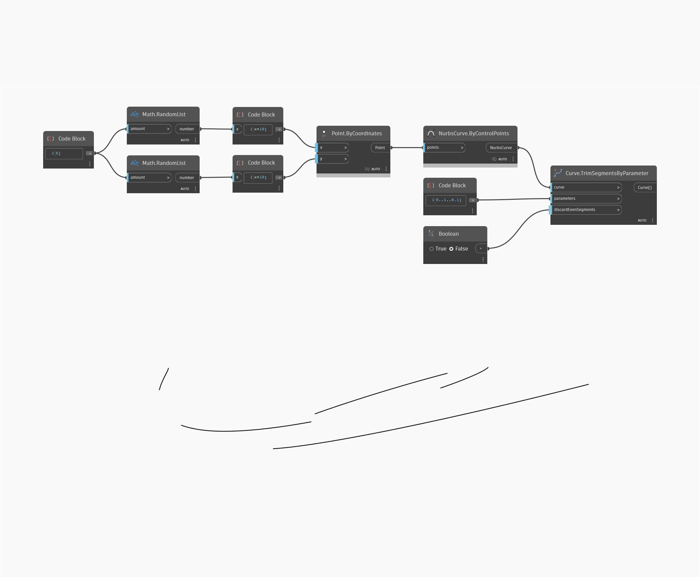

<!--- Autodesk.DesignScript.Geometry.Curve.TrimSegmentsByParameter(parameters, discardEvenSegments) --->
<!--- NAWUT5OCSCDDXI56BOEKQ7CUY4GXWEKG7CU3SYRVPVT2RF4VOOKQ --->
## 상세
곡선의 여러 세그먼트(짝수 세그먼트 취소)를 제거합니다.
___
## 예제 파일

