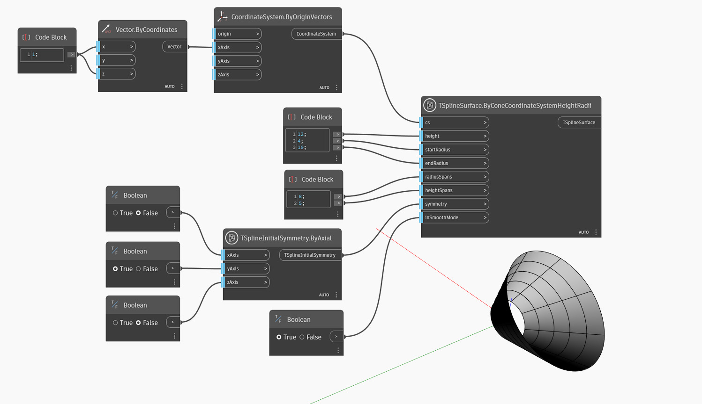

<!--- Autodesk.DesignScript.Geometry.TSpline.TSplineSurface.ByConeCoordinateSystemHeightRadii --->
<!--- O4AZYQKKSK7J5LQTW2WAZMMEFQCRSMDS5RYJ7LGVKPDRQOPRHILQ --->
## In-Depth
아래 예에서는 원추가 `cs` 입력으로 정의된 좌표계 원점에 베이스가 위치한 상태로 작성됩니다. 원추의 크기는 `height`, `startRadius` 및 `endRadius`로 설정됩니다. 방사형 및 높이 방향의 스팬은 `radiusSpans` 및 `heightSpans` 입력으로 제어됩니다. 모양의 초기 대칭은 `symmetry` 입력으로 지정됩니다. X 또는 Y 대칭이 True로 설정된 경우 방사형 스팬 값은 4의 배수여야 합니다. 마지막으로 `InSmoothMode` 입력은 T-Spline 표면의 매끄럽게 모드 미리보기와 상자 모드 미리보기 사이를 전환하는 데 사용됩니다.

## 예제 파일

