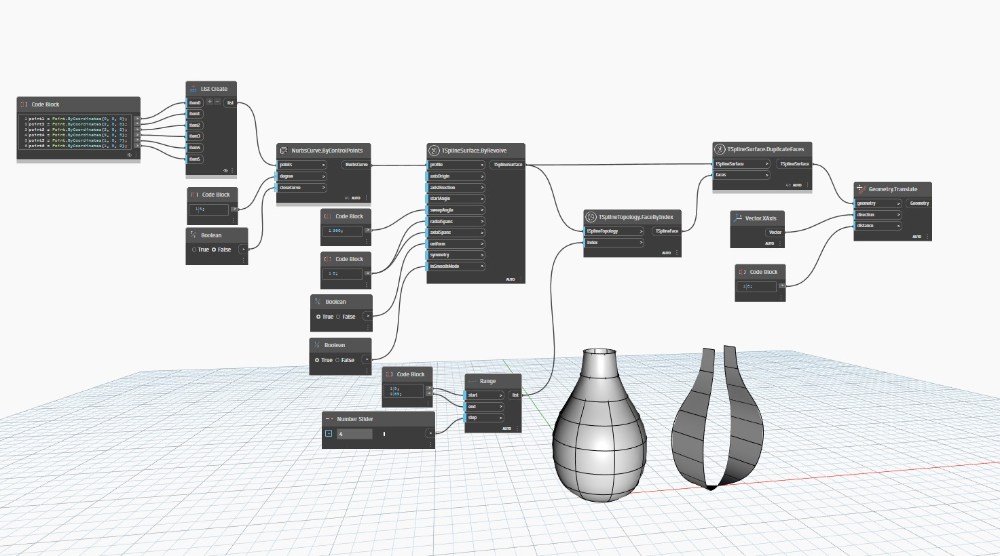

<!--- Autodesk.DesignScript.Geometry.TSpline.TSplineSurface.DuplicateFaces --->
<!--- QVBZTZWGLGK2PKP6QSZJI7UBI2Y5Z7HF4ZG7JKETOZCBLOF5IIPA --->
## 상세
`TSplineSurface.DuplicateFaces` 노드는 선택한 복사된 면으로만 구성된 새로운 T-Spline 표면을 작성합니다.

아래 예에서는 T-Spline 표면이 NURBS 곡선을 프로파일로 사용하는 `TSplineSurface.ByRevolve`를 통해 작성됩니다.
그런 다음 표면의 면 세트가 `TSplineTopology.FaceByIndex`를 사용하여 선택됩니다. 이러한 면이 `TSplineSurface.DuplicateFaces`를 사용하여 복제되고, 결과 표면은 더 나은 시각화를 위해 측면으로 이동됩니다.
___
## 예제 파일

