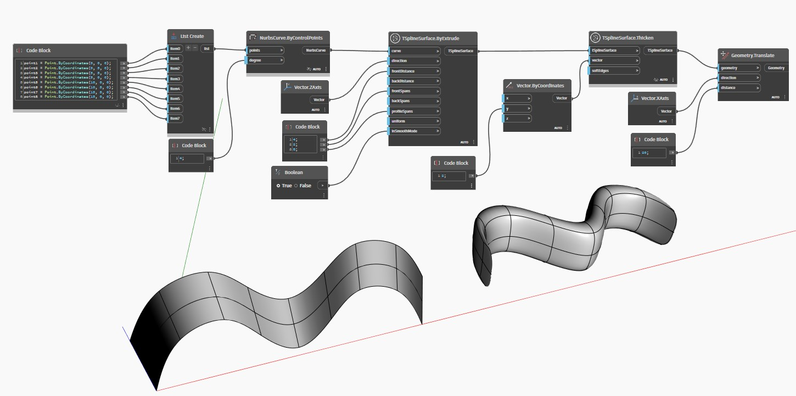

## 상세
`TSplineSurface.Thicken(vector, softEdges)`은 지정한 벡터에 따라 T-Spline 표면을 두껍게 합니다. 두껍게 하는 작업은 `vector` 방향에서 표면을 복제한 다음 해당 모서리를 결합하여 두 표면을 연결합니다. `softEdges` 부울 입력은 결과 모서리를 매끄럽게 할지(true) 아니면 각지게 할지(false) 제어합니다.

아래 예에서는 돌출된 T-Spline 표면이 `TSplineSurface.Thicken(vector, softEdges)` 노드를 사용하여 두꺼워집니다. 결과 표면이 더 나은 시각화를 위해 측면으로 이동됩니다.

___
## 예제 파일

