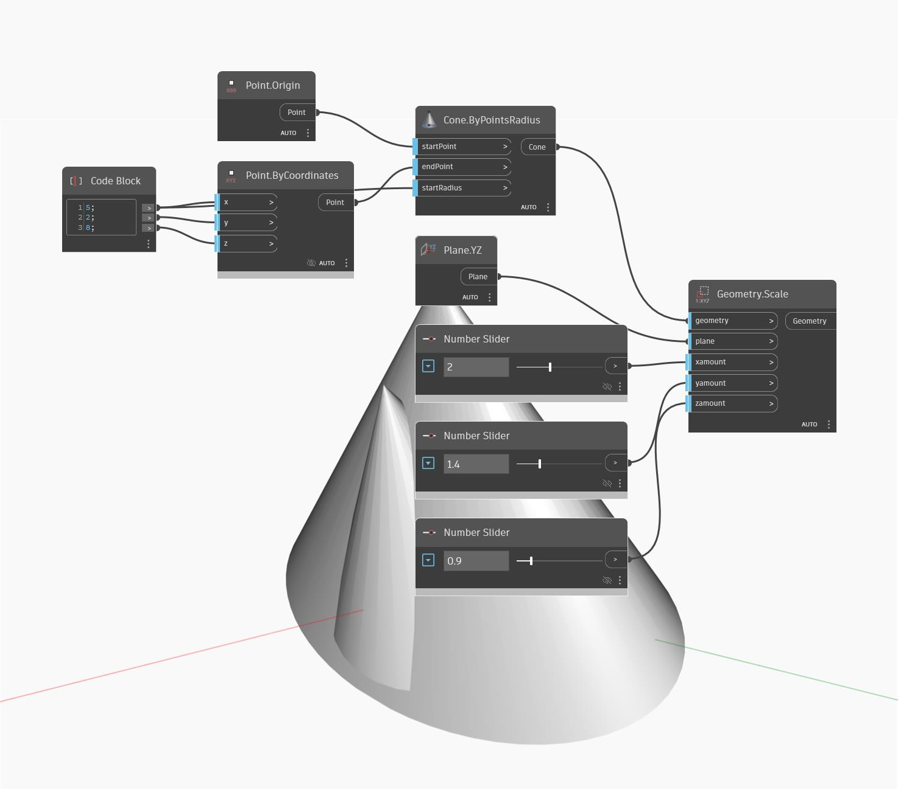

<!--- Autodesk.DesignScript.Geometry.Geometry.Scale(plane, xamount, yamount, zamount) --->
<!--- VH3KQEMEQFHQ4Z45T42EMLXFENVMZSCLRKQMQVBQNLE4YVTF5HTA --->
## 상세
지정된 평면 주위로 균일하지 않게 축척을 조정합니다.
___
## 예제 파일

