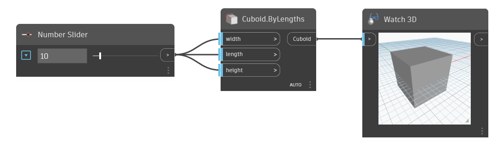

<!--- Autodesk.DesignScript.Geometry.Cuboid.ByLengths(width, length, height) --->
<!--- VKEUCM7XUAJICNIO5W65KAFEAZH4TUWVV7BPRMZSI5H5TPFZESTA --->
## 상세
Cuboid By Lengths는 폭, 길이 및 높이 입력을 사용하여 직육면체를 작성하며 중심이 표준 원점(0,0,0)에 위치합니다. 이 예에서는 숫자 슬라이더를 사용하여 길이, 폭 및 높이를 입력합니다.
___
## 예제 파일

