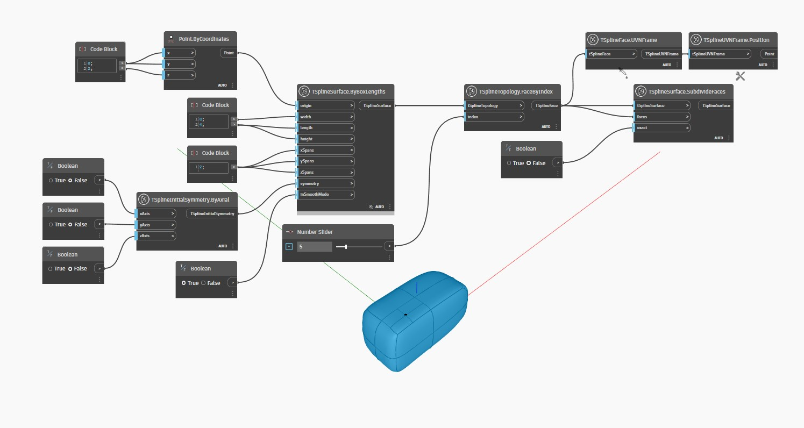

<!--- Autodesk.DesignScript.Geometry.TSpline.TSplineSurface.SubdivideFaces --->
<!--- WKY3SVAE74IVMZW7MVT4F5TGIUFXAGA2W2FN6Q6PACG3NH6AMVFA --->
## 상세
아래 예에서는 T-Spline 표면이 `TSplineSurface.ByBoxLengths` 노드를 통해 생성됩니다.
면은 `TSplineTopology.FaceByIndex` 노드를 사용하여 선택되고 `TSplineSurface.SubdivideFaces` 노드를 사용하여 세분화됩니다.
이 노드는 지정된 면을 더 작은 면(일반 면의 경우 4개, 다각형의 경우 3개, 5개 또는 그 이상)으로 분할합니다.
`exact`의 부울 입력이 true로 설정되면 결과적으로 표면이 세분화를 추가하는 동안 원본과 정확하게 동일한 모양을 유지하려고 합니다. 모양을 유지하기 위해 Iso 곡선을 더 추가할 수 있습니다. false로 설정되면 노드는 선택한 한 면만 세분화하며, 이 경우 일반적으로 원본과 별개의 표면이 생성됩니다.
`TSplineFace.UVNFrame` 및 `TSplineUVNFrame.Position` 노드는 세분화되는 면의 중심을 강조 표시하는 데 사용됩니다.
___
## 예제 파일

