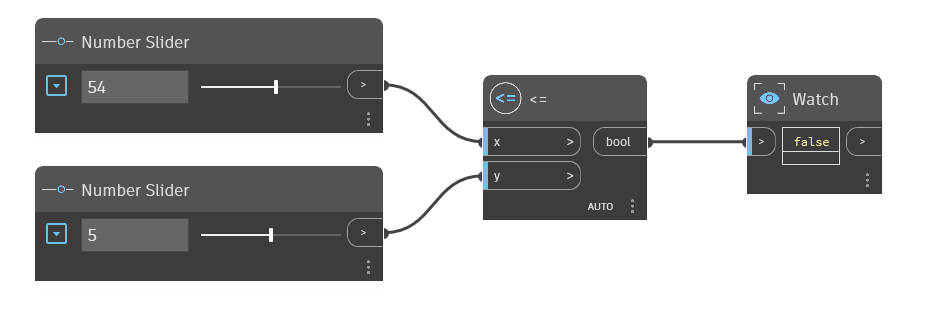

## 상세
`<=` 노드는 보다 작거나 같음 연산자입니다. `x` 입력이 `y` 입력보다 작거나 두 값이 같으면 True를 반환합니다. `x`가 `y`보다 크면 이 연산자는 False를 반환합니다. 아래 예에서는 `<=` 노드를 사용하여 `x` 입력이 `Y` 입력보다 작거나 같은지 확인하고, 두 개의 숫자 슬라이더를 사용하여 `<=` 연산자에 대한 입력을 제어합니다.
___
## 예제 파일

