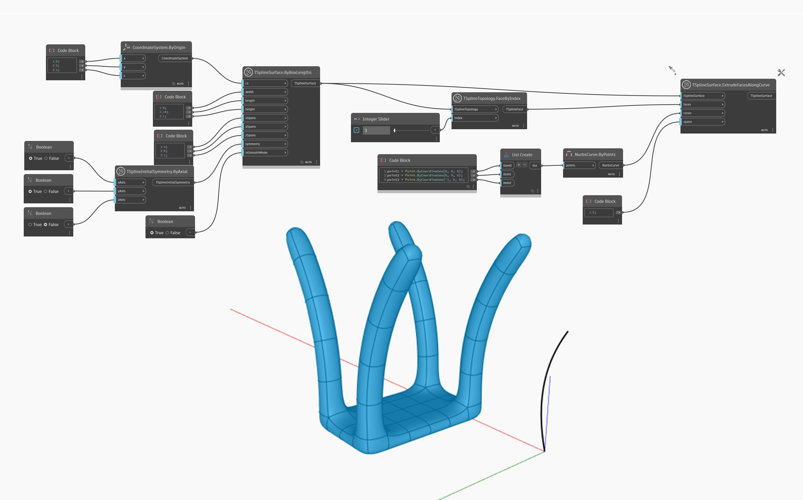

<!--- Autodesk.DesignScript.Geometry.TSpline.TSplineSurface.ExtrudeFacesAlongCurve --->
<!--- XTER6KGCJ3OP43RH5L4IEBVIW7JTSDB46DYI7BVE2UMG3DXB7HLQ --->
## 상세
아래 예에서는 상자 T-Spline 표면의 단일 면이 `TSplineTopology.FaceByIndex` 노드를 사용하여 선택됩니다. 그런 다음 면이 `TSplineSurface.ExtrudeFacesAlongCurve` 노드를 사용하여 제공된 `curve`을 따라 돌출됩니다. 결과적으로 4개의 돌출된 면이 있는 모양이 생성되고, 이는 모양에 적용된 초기 대칭으로 설명할 수 있습니다.
___
## 예제 파일

