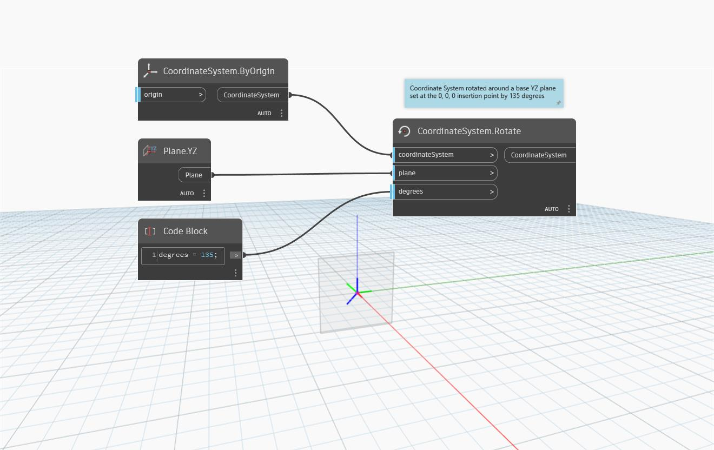

<!--- Autodesk.DesignScript.Geometry.CoordinateSystem.Rotate(coordinateSystem, plane, degrees) --->
<!--- ZF4ATQU6FEYXLGNLBEREZ7EQLGEQUAOWM5PGJ2LCQJBV3EEJUIPQ --->
## 상세
`CoordinateSystem.Rotate (coordinateSystem, plane, degrees)`는 평면을 중심으로 지정된 각도만큼 회전된 새 CoordinateSystem을 반환합니다.

아래 예에서는 0, 0, 0 삽입점에 설정된 기준 YZ 평면을 중심으로 CoordinateSystem이 135도 회전합니다.

___
## 예제 파일

