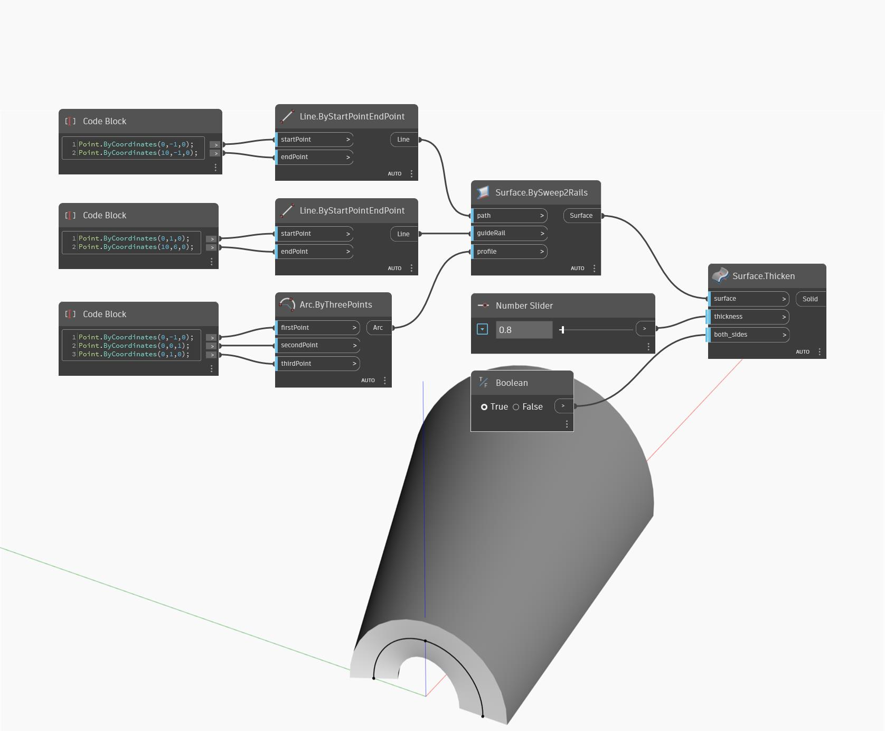

<!--- Autodesk.DesignScript.Geometry.Surface.Thicken(thickness, both_sides) --->
<!--- 4FFK6PGYCVKERZWXQC6TEBOQTHVXXN3QLAX5MTLXGZEAB4KH4WEQ --->
## Informacje szczegółowe
Pogrub powierzchnię w bryłę, wyciągając w kierunku wektorów normalnych powierzchni. Jeśli parametr both_sides ma wartość prawda (true), powierzchnia zostaje pogrubiona po obu stronach.
___
## Plik przykładowy

