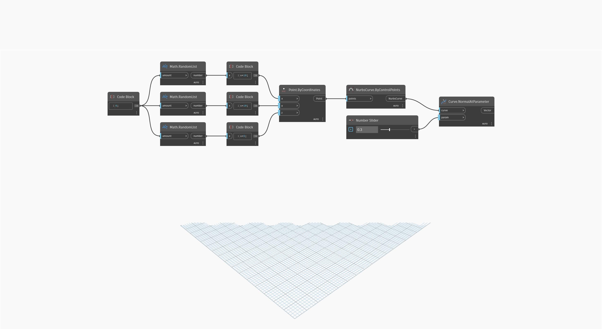

<!--- Autodesk.DesignScript.Geometry.Curve.NormalAtParameter(curve, param) --->
<!--- 5EEABYHH2K4RVCNKX3VDCP7ZRLFAMGC7UDSBANQMVEBFNNE3SPYQ --->
## Informacje szczegółowe
Węzeł `Curve.NormalAtParameter (curve, param)` zwraca wektor wyrównany zgodnie z kierunkiem wektora normalnego dla określonego parametru (param) krzywej (curve). Parametryzacja krzywej jest mierzona w zakresie od 0 do 1, przy czym 0 oznacza początek krzywej, a 1 oznacza jej koniec.

W poniższym przykładzie najpierw tworzymy krzywą NurbsCurve za pomocą węzła `NurbsCurve.ByControlPoints` z danymi wejściowymi w postaci zestawu losowo wygenerowanych punktów. Suwak Number Slider ustawiony na zakres od 0 do 1 steruje pozycją danych wejściowych `parameter` węzła `Curve.NormalAtParameter`.
___
## Plik przykładowy

