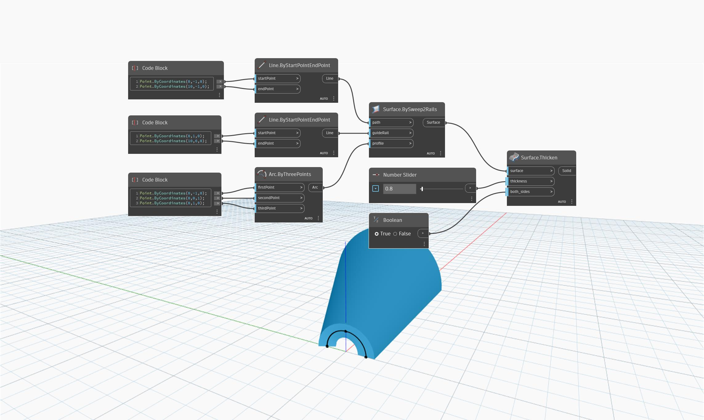

<!--- Autodesk.DesignScript.Geometry.Surface.Thicken(surface, thickness, both_sides) --->
<!--- 5HLUQKT3UZOAWPJMHUXPRYXIG5HOMTLY5RMTZVDGAABIO5MZ3OVQ --->
## Informacje szczegółowe
Węzeł `Surface.Thicken (surface, thickness, both_sides)` tworzy bryłę przez odsunięcie powierzchni zgodnie z pozycją danych wejściowych `thickness`, zamykając końce, aby zamknąć bryłę. Ten węzeł ma dodatkową pozycję danych wejściowych określającą, czy pogrubiać po obu stronach, czy nie. Pozycja danych wejściowych `both_sides` przyjmuje wartość logiczną (Boolean): „prawda” (True) oznacza pogrubienie po obu stronach, a „fałsz” (False) — po jednej stronie. Należy pamiętać, że parametr `thickness` określa całkowitą grubość bryły końcowej, więc jeśli parametr `both_sides` ma wartość True, wynik zostanie odsunięty od oryginalnej powierzchni o połowę grubości wejściowej po obu stronach.

W poniższym przykładzie najpierw tworzymy powierzchnię za pomocą węzła `Surface.BySweep2Rails`. Następnie tworzymy bryłę za pomocą suwaka Number Slider w celu określenia wartości wejściowej `thickness` węzła `Surface.Thicken`. Przełącznik wartości logicznej (Boolean) określa, czy pogrubiać po obu stronach, czy tylko po jednej.

___
## Plik przykładowy

