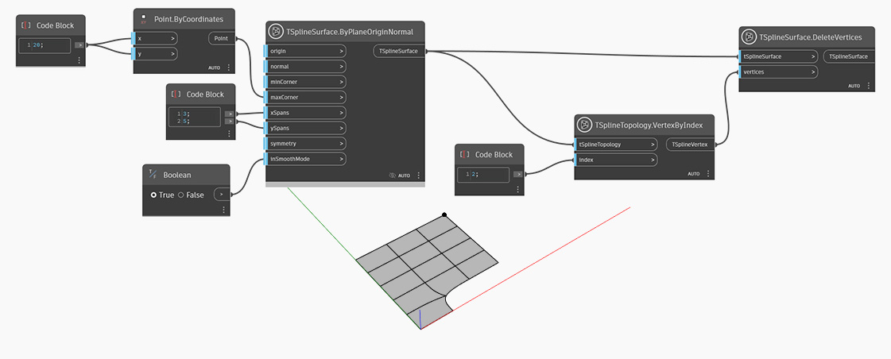

<!--- Autodesk.DesignScript.Geometry.TSpline.TSplineSurface.DeleteVertices --->
<!--- 76IVI422OMRMPHCWZHTETSZ3PJF22AOV2AX274LZCNLPCK664PGQ --->
## Informacje szczegółowe
W poniższym przykładzie przy użyciu węzła `TSplineSurface.ByPlaneOriginNormal` zostaje utworzona powierzchnia T-splajn prymitywu płaszczyznowego. Za pomocą węzła `TSplineTopology.VertexByIndex` zostaje wybrane zestaw wierzchołków, który zostaje następnie przekazany jako dane wejściowe do węzła `TSplineSurface.DeleteVertices`. W wyniku tego wszystkie krawędzie dochodzące do wybranego wierzchołka również zostają usunięte.

## Plik przykładowy

