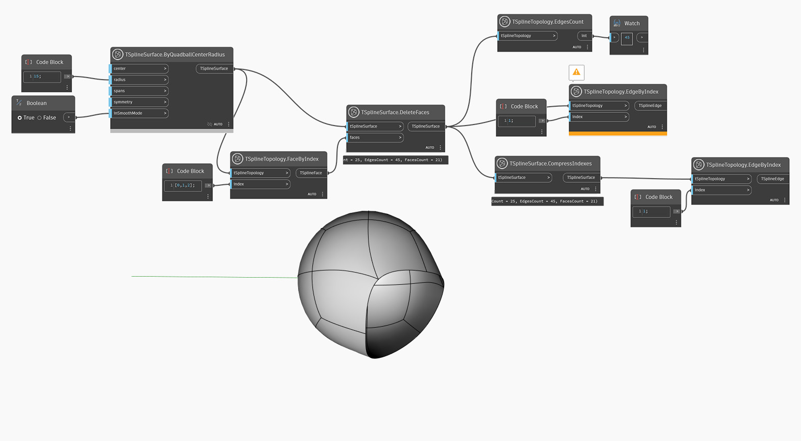

<!--- Autodesk.DesignScript.Geometry.TSpline.TSplineSurface.CompressIndexes --->
<!--- ARIV6OQ22ACATWAIKGM7OHNEJS2TQUOKUSEU6UNX6EAAVSJIMK3A --->
## Informacje szczegółowe
Węzeł `TSplineSurface.CompressIndexes` usuwa przerwy w numerach indeksów krawędzi, wierzchołków lub powierzchni w powierzchni T-splajn, które są wynikiem różnych operacji, takich jak operacja usuwania powierzchni. Kolejność indeksów jest zachowywana.

W poniższym przykładzie z powierzchni prymitywu kuli kwadrantowej usunięto pewną liczbę powierzchni, co wpływa na indeksy krawędzi tego kształtu. Węzeł `TSplineSurface.CompressIndexes` zostaje użyty do naprawienia indeksów krawędzi kształtu, aby umożliwić wybranie krawędzi o indeksie 1.

## Plik przykładowy

