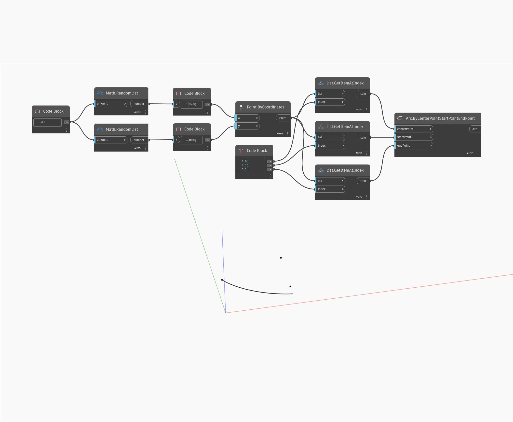

## Informacje szczegółowe
Węzeł Arc ByCenterPointStartPointEndPoint rysuje najlepiej dopasowany łuk wokół określonego środka. Łuk zawsze zaczyna się w punkcie początkowym i kończy się w najbliższym możliwym punkcie do danego punktu końcowego. W tym przykładzie pokazano tę właściwość przez losowe przekazanie do węzła trzech losowych punktów wskazujących środek, punkt początkowy i punkt końcowy.
___
## Plik przykładowy

