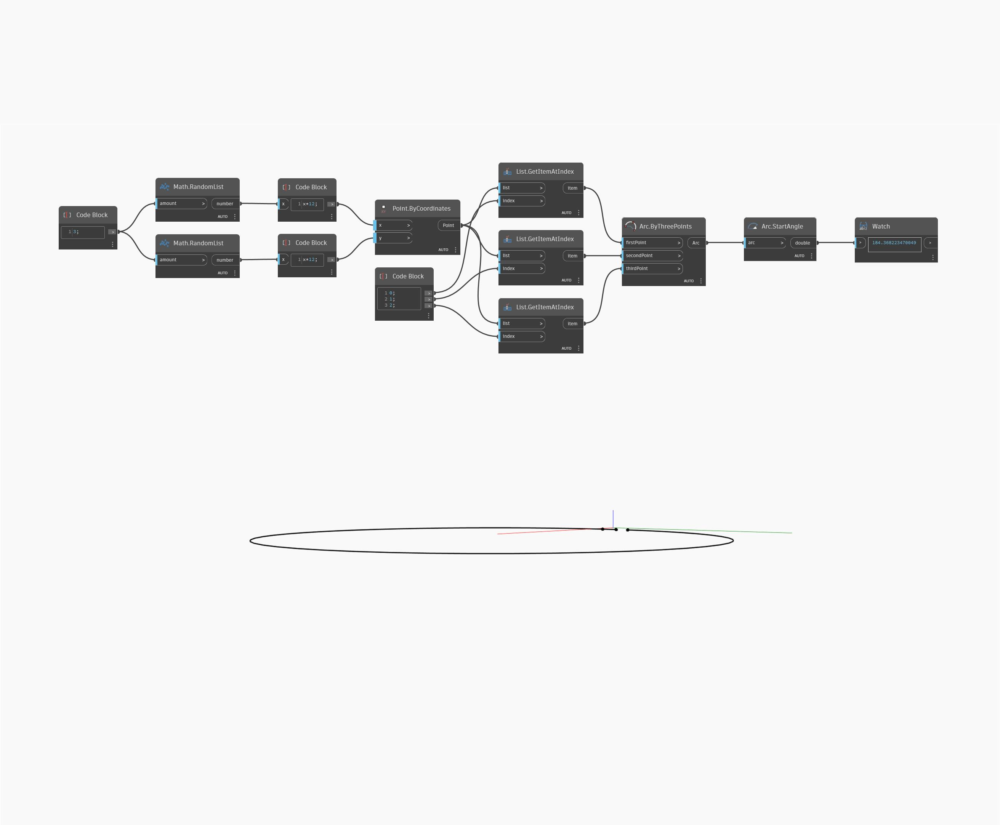

## Informacje szczegółowe
Węzeł Start Angle znajduje kąt początkowy łuku elipsy. Jest on mierzony w stopniach w kierunku przeciwnym do ruchu wskazówek zegara, rozpoczynając od osi X płaszczyzny. W tym przykładzie najpierw tworzymy łuk elipsy, używając płaszczyzny XY i szeregu suwaków Number Slider. Następnie używamy węzła Start Angle, aby wyodrębnić kąt punktu początkowego elipsy.
___
## Plik przykładowy

