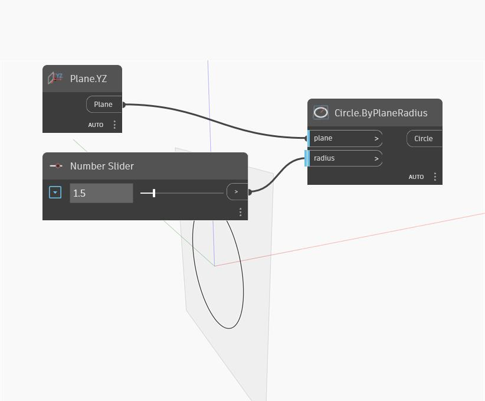

## Informacje szczegółowe
Circle By Plane Radius jest węzłem skondensowanym, za pomocą którego można utworzyć dowolny typ okręgu. W tym przykładzie używamy płaszczyzny YZ do określenia kierunku okręgu oraz suwaka Number Slider do dynamicznego sterowania promieniem okręgu.
___
## Plik przykładowy

