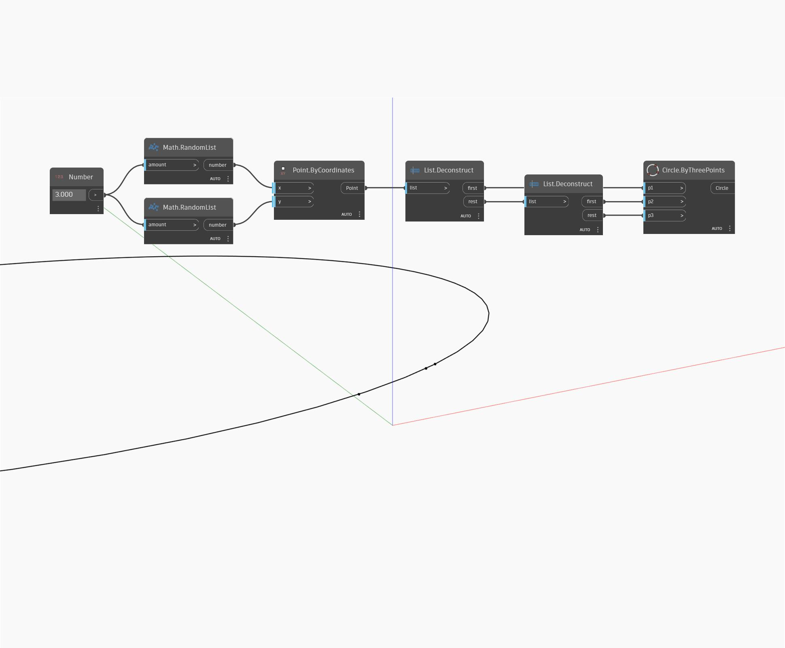

## Informacje szczegółowe
Węzeł `Circle.ByThreePoints` pobiera 3 punkty wejściowe i tworzy okrąg przechodzący przez każdy z nich.

W poniższym przykładzie tworzymy okrąg za pomocą 3 losowo wygenerowanych punktów na płaszczyźnie Z.

___
## Plik przykładowy

