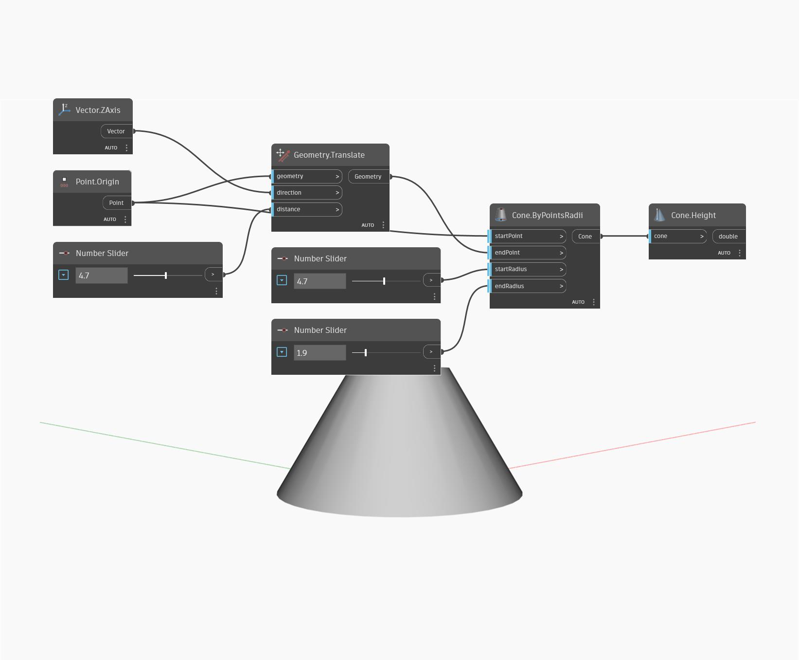

## Informacje szczegółowe
Węzeł `Cone.Height` znajduje wysokość stożka, która jest równa odległości między jego punktami początkowym i końcowym.

W poniższym przykładzie tworzymy stożek, określając punkt początkowy i końcowy oraz promień początkowy i końcowy. Następnie możemy wyodrębnić wysokość stożka za pomocą węzła `Cone.Height`.

___
## Plik przykładowy

