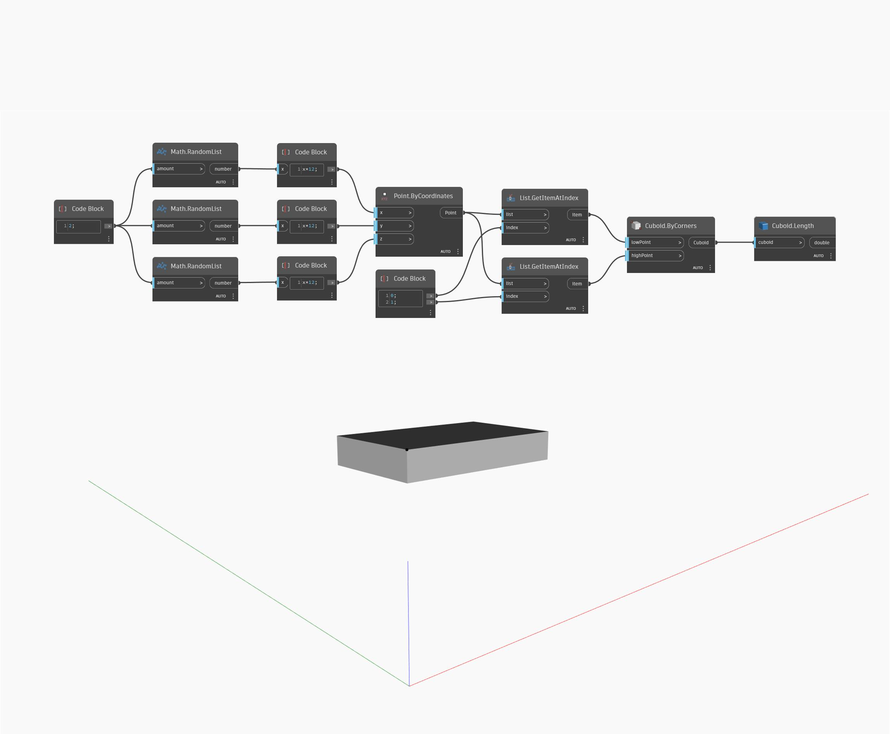

## Informacje szczegółowe
Węzeł `Cuboid.Length` zwraca długość prostopadłościanu wejściowego. Uwaga: jeśli prostopadłościan przekształcono do innego układu współrzędnych za pomocą współczynnika skali, ten węzeł zwróci pierwotne wymiary prostopadłościanu, a nie wymiary przestrzeni globalnej.

W tym przykładzie generujemy prostopadłościan na podstawie narożników, a następnie za pomocą węzła `Cuboid.Length` znajdujemy jego długość.

___
## Plik przykładowy

