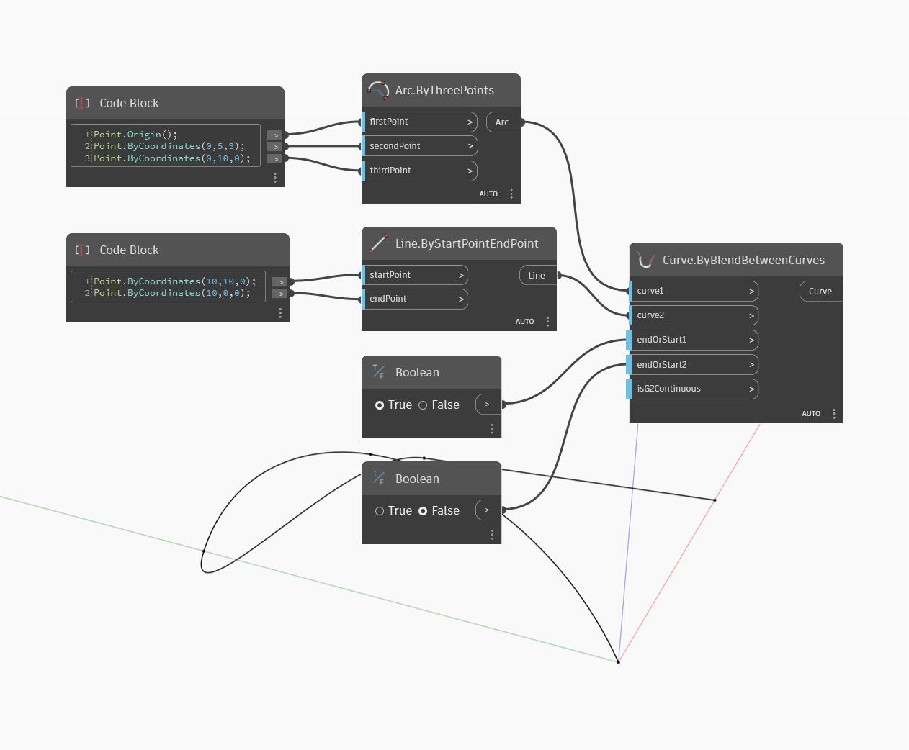

## Informacje szczegółowe
Węzeł Curve by Blend Between Curves tworzy nową krzywą łączącą dwie krzywe wejściowe. Dwie wartości wejściowe „endOrStart” określają, czy należy połączyć punkty końcowe, czy początkowe każdej krzywej. Utworzona krzywa będzie zgodna z krzywizną pierwotnych krzywych w punktach połączenia. W poniższym przykładzie zaczynamy od jednego łuku i jednej linii. Łączymy początek łuku i koniec linii w celu połączenia tych dwóch krzywych. Dwa węzły przełączania logicznego umożliwiają sterowanie tym, między którymi końcami tych dwóch krzywych należy utworzyć połączenie.
___
## Plik przykładowy

