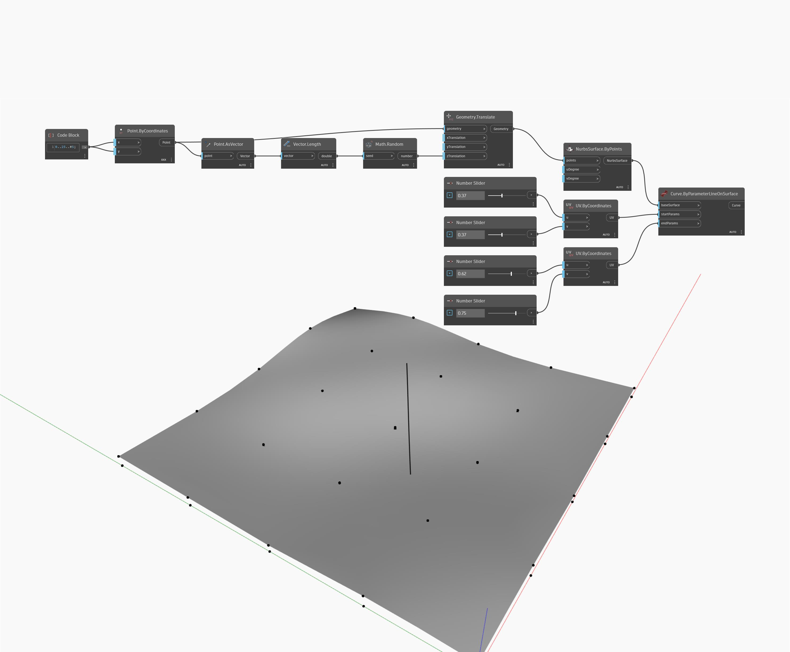

## Informacje szczegółowe
Węzeł Curve by Parameter Line On Surface tworzy linię wzdłuż powierzchni między dwoma wejściowymi współrzędnymi UV. W poniższym przykładzie najpierw tworzymy siatkę punktów i przekształcamy je w kierunku osi Z o losową wartość. Punkty te są używane do utworzenia powierzchni za pomocą węzła NurbsSurface.ByPoints. Ta powierzchnia jest używana jako wejście baseSurface węzła ByParameterLineOnSurface. Zestaw suwaków Number Slider służy do dostosowywania wartości wejściowych U i V dwóch węzłów UV.ByCoordinates, które są następnie używane do określania punktu początkowego i końcowego linii na powierzchni.
___
## Plik przykładowy

