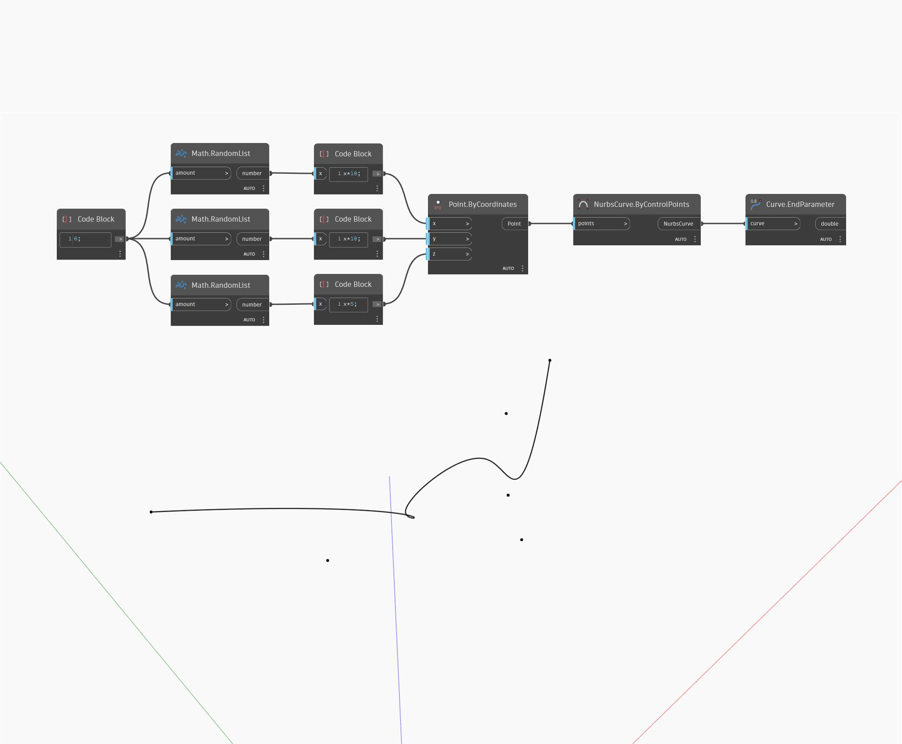

## Informacje szczegółowe
Węzeł End Parameter zwraca liczbę reprezentującą koniec dziedziny, w którym można obliczyć krzywą wejściową. W większości przypadków parametr końcowy ma wartość jeden. W poniższym przykładzie najpierw tworzymy krzywą Nurbs za pomocą węzła ByControlPoints na podstawie zestawu losowo wygenerowanych punktów. Ta krzywa jest następnie używana jako dane wejściowe węzła EndParameter.
___
## Plik przykładowy

