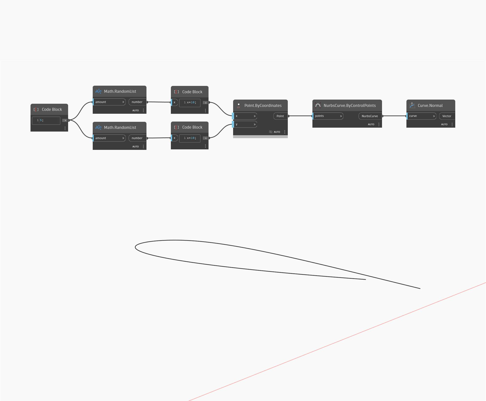

## Informacje szczegółowe
Węzeł `Curve.Normal` zwraca wektor normalny krzywej wejściowej. W przypadku tego węzła krzywa musi być płaska.

W poniższym przykładzie najpierw tworzymy krzywą NurbsCurve za pomocą węzła `NurbsCurveByControlPoints` z danymi wejściowymi w postaci zestawu losowo wygenerowanych punktów. Następnie za pomocą węzła `Curve.Normal` znajdujemy wektor normalny tej krzywej.

___
## Plik przykładowy

