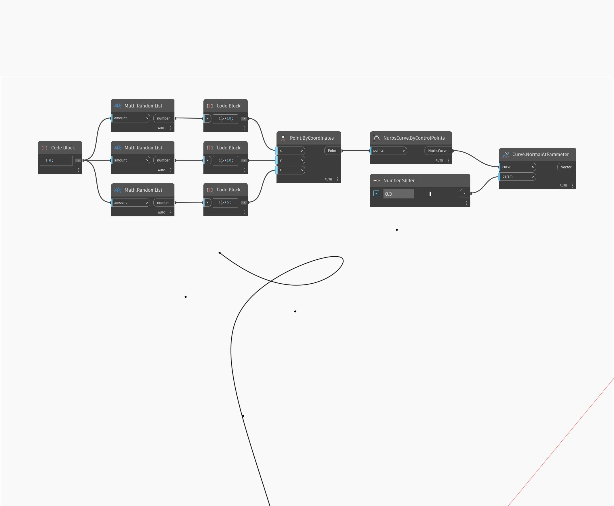

## Informacje szczegółowe
Węzeł Normal At Parameter pobiera parametry wejściowe U i V, a zwraca wektor normalny powierzchni w położeniu wejściowym UV na tej powierzchni. W poniższym przykładzie najpierw tworzymy powierzchnię za pomocą węzła Sweep2Rails. Następnie za pomocą dwóch suwaków Number Slider określamy parametry U i V, aby wyznaczyć wektor normalny za pomocą węzła NormalAtParameter.
___
## Plik przykładowy

