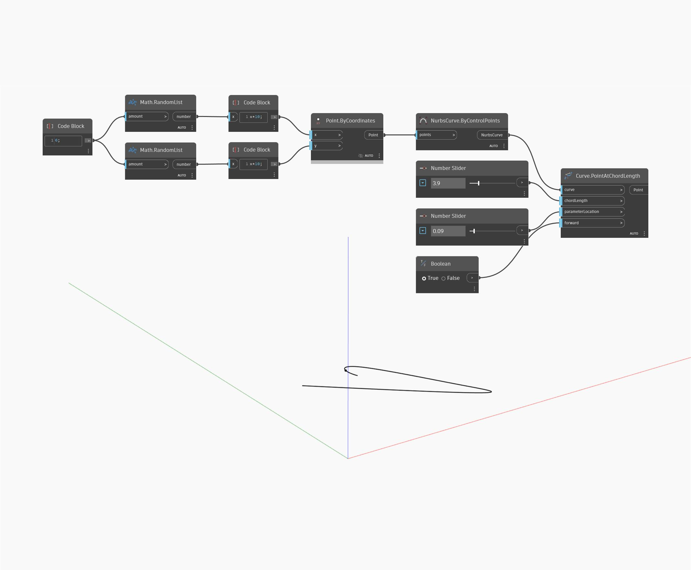

## Informacje szczegółowe
Węzeł Point At Chord Length zwraca punkt, który wypada na długości danej cięciwy od określonego na początku parametru. W poniższym przykładzie najpierw tworzymy krzywą Nurbs za pomocą węzła ByControlPoints na podstawie zestawu losowo wygenerowanych punktów. Suwak Number Slider służy do sterowania odległością cięciwy będącej linią prostą, w której należy znaleźć punkt. Drugi suwak Number Slider ustawiony na zakres od 0 do 1 służy do sterowania punktem początkowym na krzywej, od którego jest mierzona odległość cięciwy. Ostatnim elementem jest przełącznik logiczny służący do określania kierunku pomiaru odległości cięciwy.
___
## Plik przykładowy

