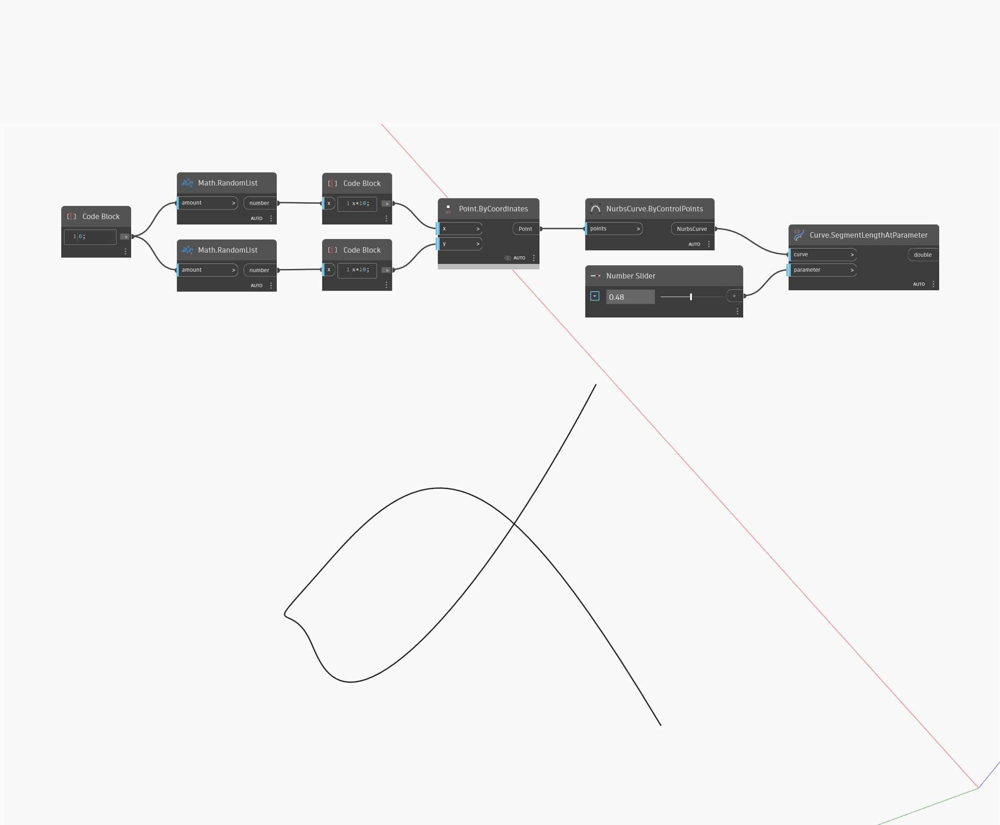

## Informacje szczegółowe
Węzeł Segment Length At Parameter zwraca długość krzywej (curve) między punktem początkowym a parametrem wejściowym (parameter), przy czym zero jest parametrem na początku krzywej, a jeden — na jej końcu. W poniższym przykładzie używamy dwóch zestawów liczb losowych do wygenerowania listy punktów. Punkty te są używane do utworzenia krzywej Nurbs za pomocą węzła By Control Points. Suwak Number Slider ustawiony na zakres od 0 do 1 steruje parametrem wejściowym dla węzła SegmentLengthAtParameter.
___
## Plik przykładowy

