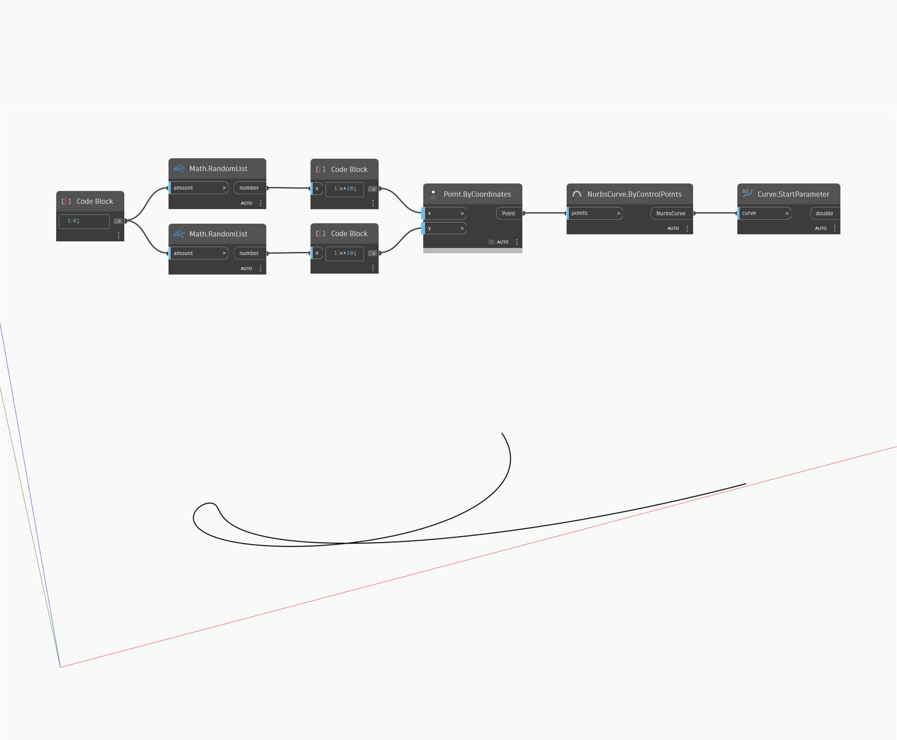

## Informacje szczegółowe
Węzeł Start Parameter zwraca liczbę reprezentującą początek dziedziny, w którym można obliczyć krzywą wejściową. W większości przypadków parametr początkowy ma wartość zero. W poniższym przykładzie najpierw utworzymy krzywą Nurbs za pomocą węzła ByControlPoints na podstawie zestawu losowo wygenerowanych punktów. Ta krzywa jest następnie używana jako dane wejściowe węzła StartParameter.
___
## Plik przykładowy

