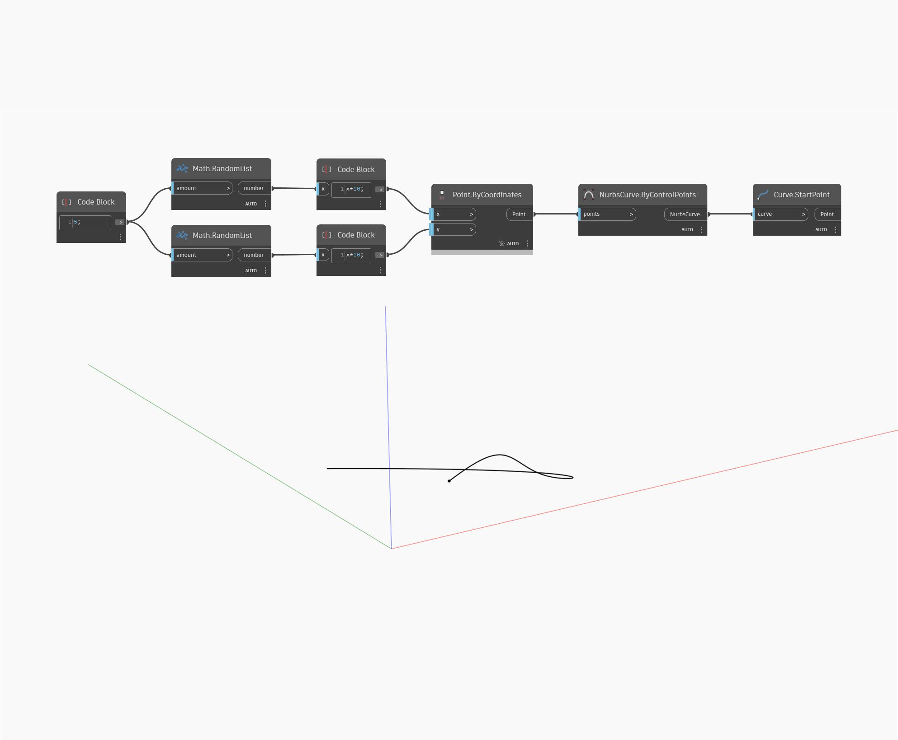

## Informacje szczegółowe
Węzeł Start Point zwraca punkt początkowy krzywej wejściowej. W poniższym przykładzie najpierw tworzymy krzywą Nurbs za pomocą węzła ByControlPoints na podstawie zestawu losowo wygenerowanych punktów. Punkt początkowy tej krzywej można znaleźć za pomocą węzła StartPoint.
___
## Plik przykładowy

