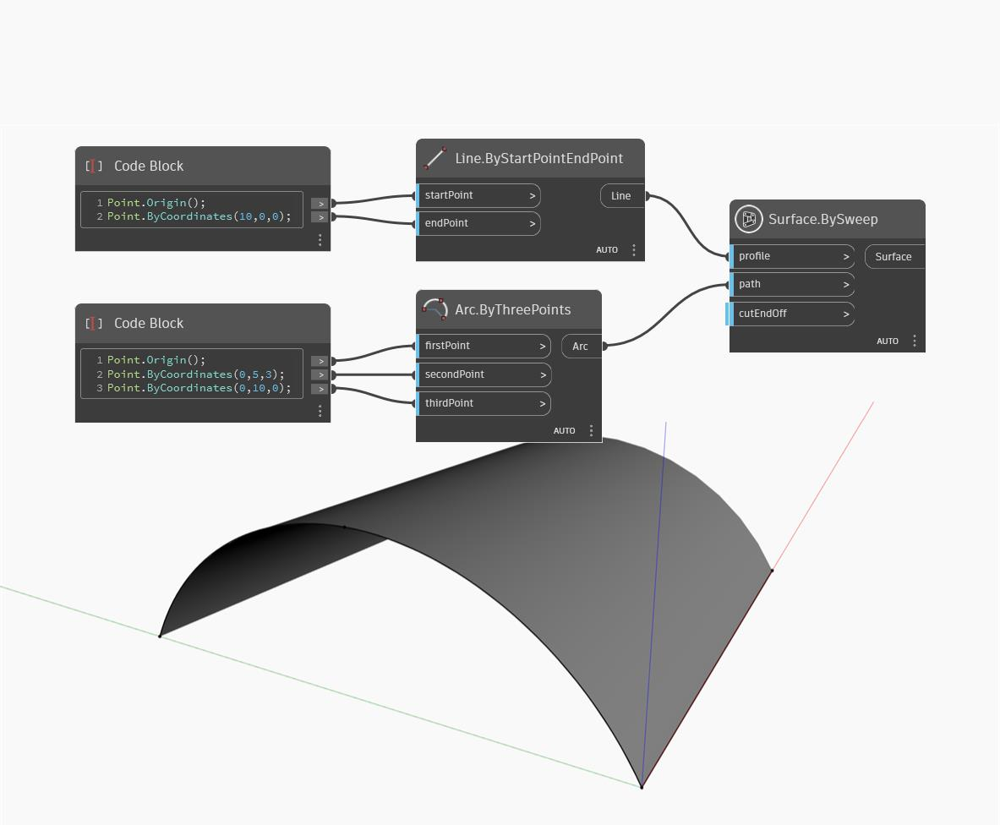

## Informacje szczegółowe
Węzeł SweepAsSurface tworzy powierzchnię przez przeciągnięcie krzywej wejściowej wzdłuż określonej ścieżki (path). W poniższym przykładzie tworzymy krzywą do przeciągnięcia, tworząc za pomocą węzła Code Block trzy punkty dla węzła Arc.ByThreePoints. Krzywa ścieżki jest tworzona jako linia prosta wzdłuż osi X. Węzeł SweepAsSurface przesuwa krzywą profilu wzdłuż krzywej ścieżki, tworząc powierzchnię.
___
## Plik przykładowy

