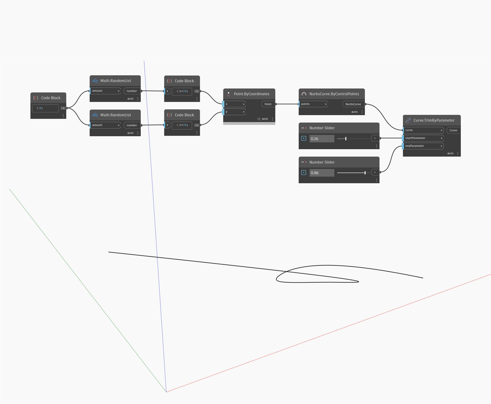

## Informacje szczegółowe
Węzeł Trim By Parameter usuwa początek i koniec krzywej wejściowej (curve) przez ucięcie krzywej przy określonych parametrach i zwraca wynikowy środkowy fragment krzywej. W poniższym przykładzie najpierw tworzymy krzywą Nurbs za pomocą węzła ByControlPoints na podstawie zestawu losowo wygenerowanych punktów. Dwa suwaki Number Slider ustawione na zakres od 0 do 1 sterują parametrami wejściowymi początku i końca dla węzła TrimByParameter.
___
## Plik przykładowy

