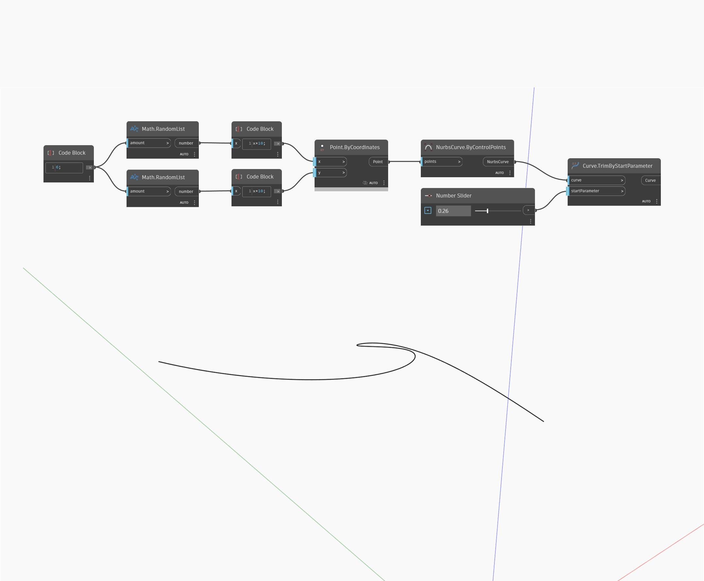

## Informacje szczegółowe
Węzeł Trim By Start Parameter usuwa początek krzywej wejściowej (curve) przez ucięcie krzywej przy określonym parametrze. W poniższym przykładzie najpierw tworzymy krzywą Nurbs za pomocą węzła ByControlPoints na podstawie zestawu losowo wygenerowanych punktów. Suwak Number Slider ustawiony na zakres od 0 do 1 steruje parametrem wejściowym dla węzła TrimByStartParameter.
___
## Plik przykładowy

