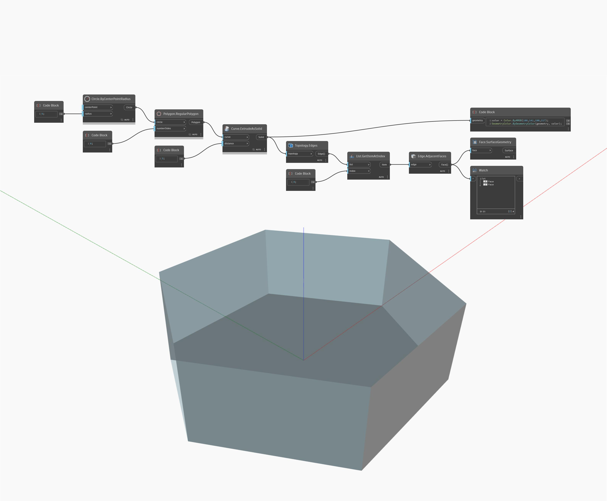

## Informacje szczegółowe
Węzeł AdjacentFaces zwraca płaszczyzny przylegające do wierzchołka wejściowego. W poniższym przykładzie wierzchołek prostopadłościanu zwraca listę trzech płaszczyzn. Dopasowanie suwaka Index Selector spowoduje zmianę wierzchołka wejściowego i zwrócenie innego zestawu przylegających płaszczyzn. Płaszczyzny są reprezentowane za pomocą powierzchni.
___
## Plik przykładowy

