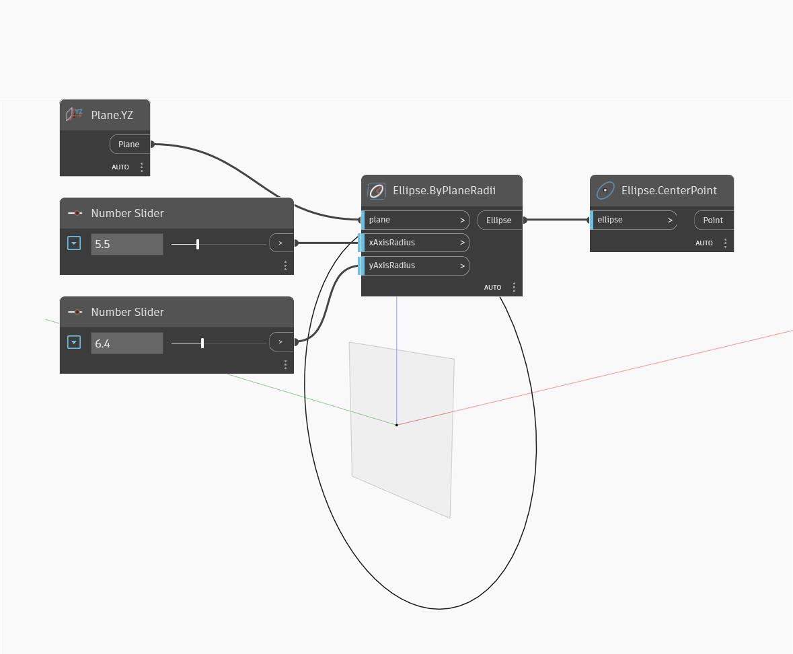

## Informacje szczegółowe
Węzeł `Ellipse.CenterPoint` zwraca punkt środkowy elipsy wejściowej. Uwaga: ten punkt nie zawiera żadnych informacji o orientacji ani płaszczyźnie elipsy.

W poniższym przykładzie najpierw tworzymy elipsę za pomocą węzła`Ellipse.ByPlaneRadii`, a następnie znajdujemy punkt środkowy.

___
## Plik przykładowy

