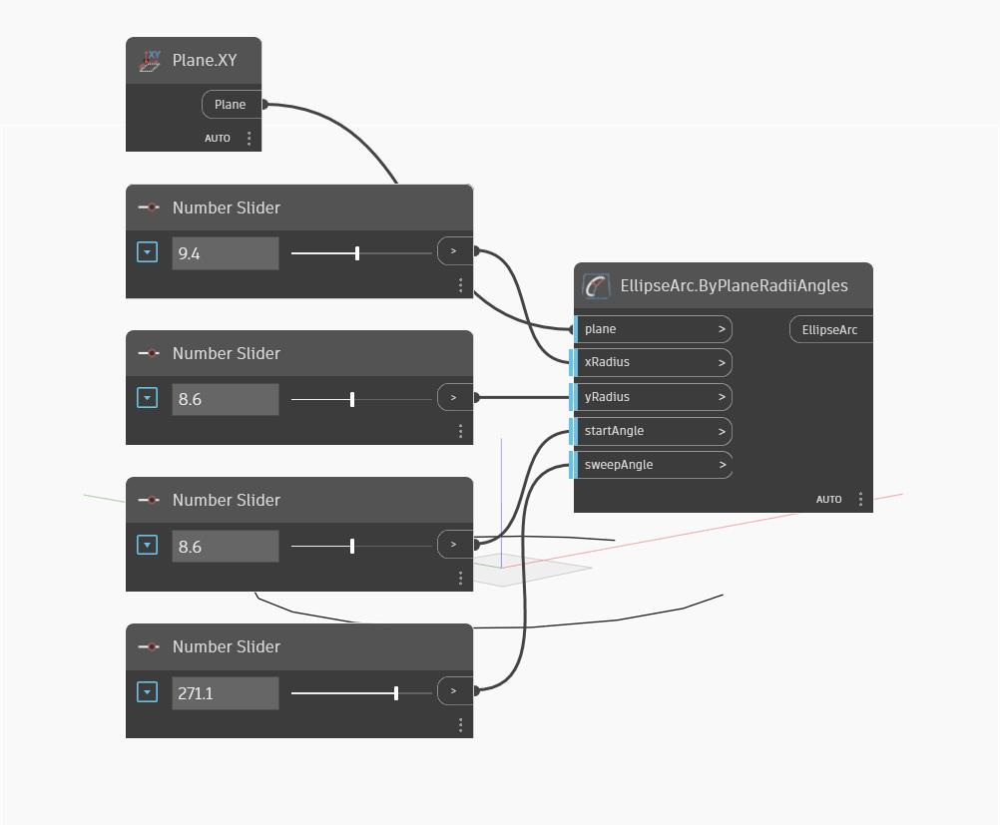

## Informacje szczegółowe
Węzeł Ellipse Arc by Plane Radii Angles tworzy fragment elipsy. Wartości wejściowe xRadius i yRadius określają promienie elipsy wzdłuż kierunków X i Y płaszczyzny wejściowej (plane); kierunki te mogą różnić się od kierunków globalnych X i Y. Wartość wejściowa startAngle definiuje w stopniach punkt początkowy łuku elipsy, który biegnie w kierunku przeciwnym do ruchu wskazówek zegara od osi X płaszczyzny i kończy się po uzyskaniu całkowitej długości łuku określonej przez wartość wejściową sweepAngle. W poniższym przykładzie używamy płaszczyzny XY i szeregu suwaków Number Slider do sterowania innymi parametrami wejściowymi.
___
## Plik przykładowy

