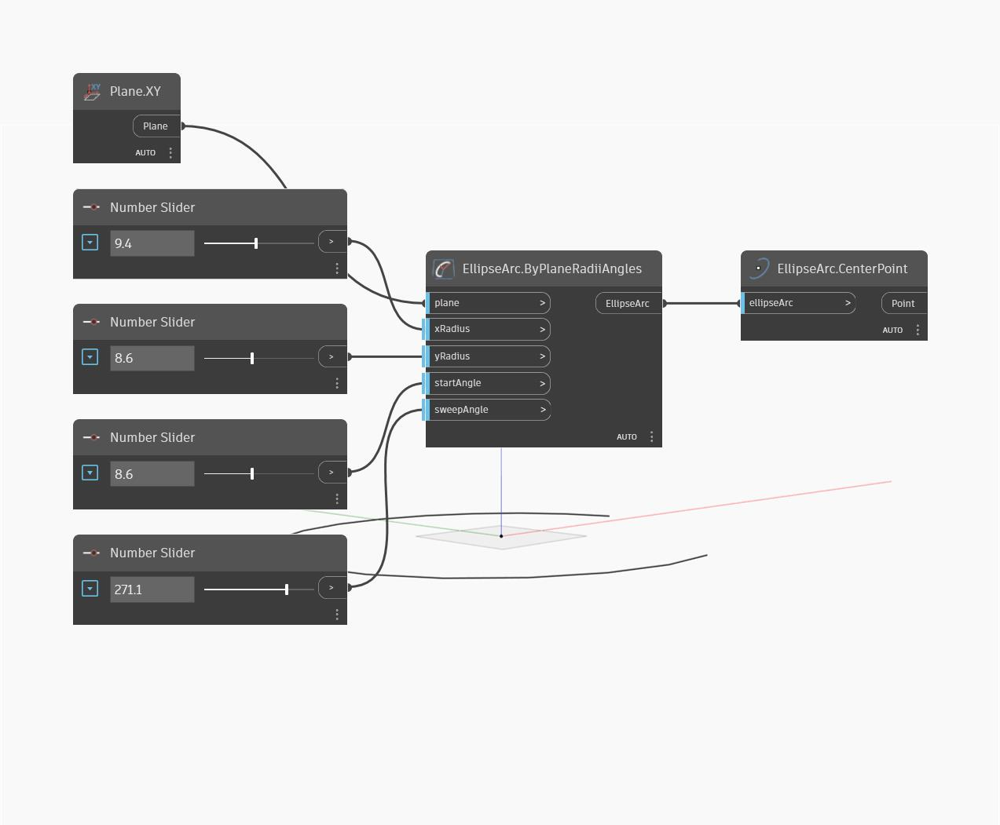

## Informacje szczegółowe
Węzeł `EllipseArc.CenterPoint` znajduje punkt środkowy łuku elipsy — ten sam punkt co w przypadku punktu środkowego pełnej elipsy.

W poniższym przykładzie najpierw tworzymy łuk elipsy za pomocą płaszczyzny XY i serii suwaków Number Slider. Następnie za pomocą węzła `EllipseArc.CenterPoint` wyodrębniamy środek elipsy.

___
## Plik przykładowy

