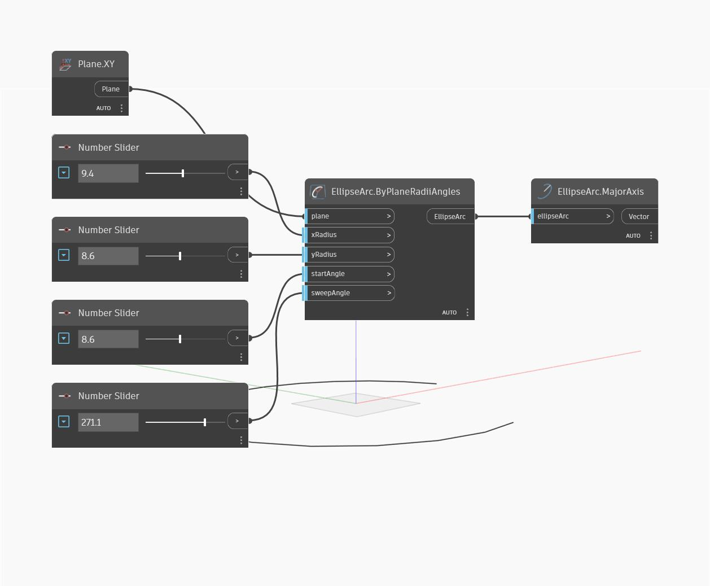

## Informacje szczegółowe
Węzeł Major Axis zwraca dłuższą z dwóch osi elipsy. Oś jest zwracana jako wektor, którego moduł jest równy wielkości większego z dwóch promieni. Uwaga: osie wielka i mała są określane na podstawie długości, a nie kierunku. Oznacza to, że w przypadku jednej elipsy oś wielka może odpowiadać wartości xAxisRadius, a w przypadku innej elipsy — wartości yAxisRadius. W tym przykładzie najpierw tworzymy łuk eliptyczny za pomocą płaszczyzny XY i szeregu suwaków Number Slider. Następnie za pomocą węzła Major Axis wyodrębniamy oś wielką elipsy.
___
## Plik przykładowy

