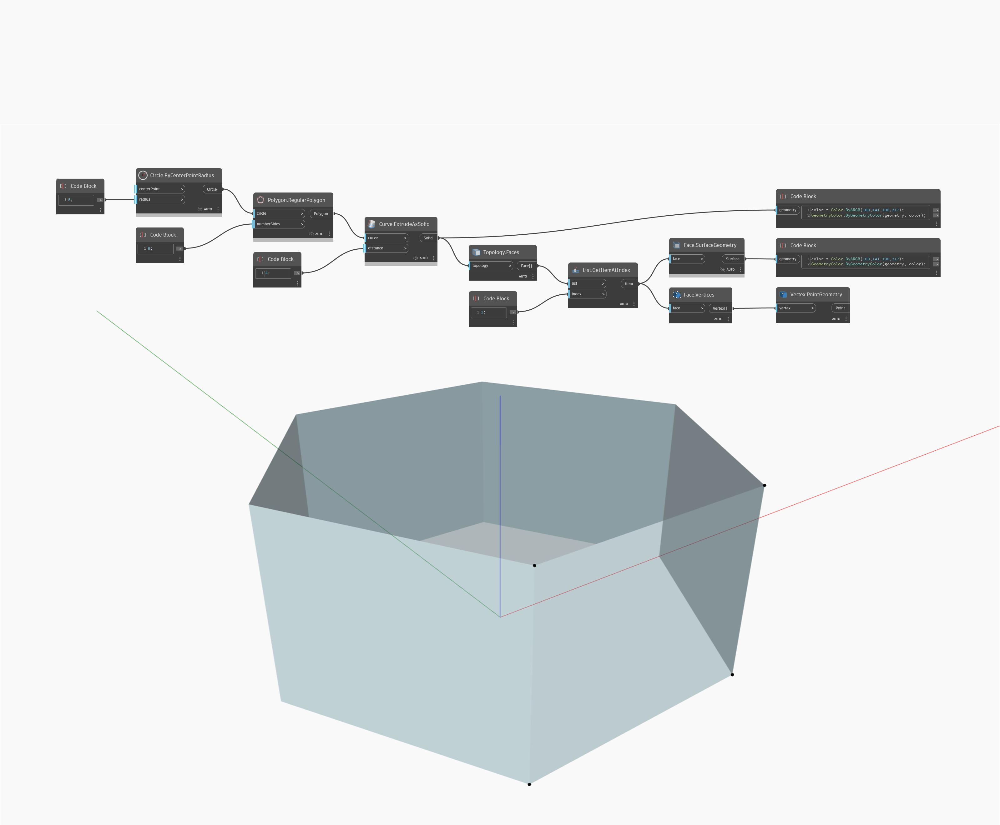

## Informacje szczegółowe
Węzeł Vertices zwraca listę położeń wierzchołków dla geometrii wejściowej. W poniższym przykładzie dla prostopadłościanu zwracana jest lista położeń 8 wierzchołków.
___
## Plik przykładowy

