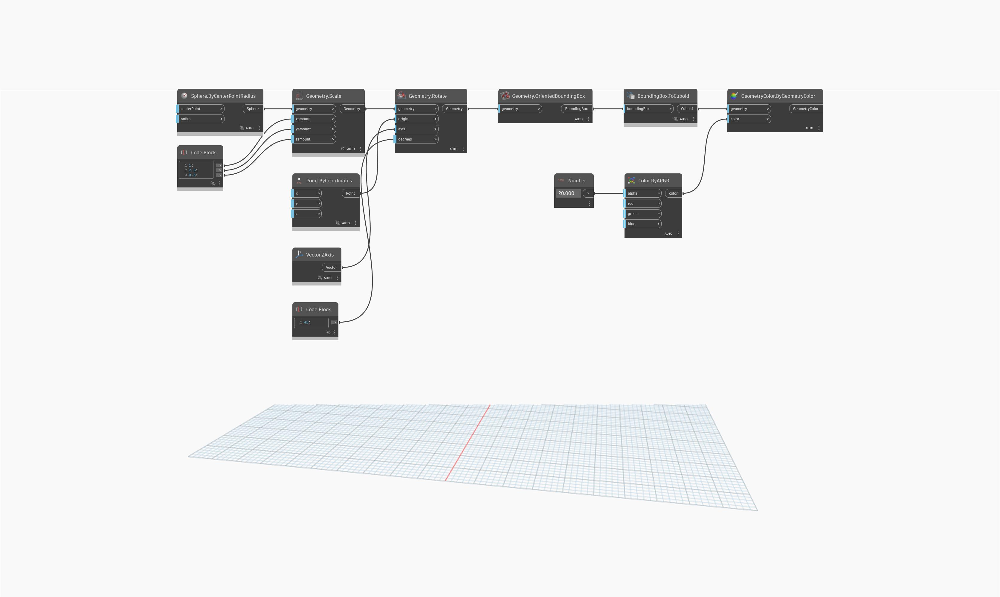

## Informacje szczegółowe
Węzeł `Geometry.OrientedBoundingBox` zwraca ramkę zorientowaną o minimalnej objętości zdefiniowaną przez zawartą w niej geometrię. Ramka BoundingBox nie jest wyświetlana, ale można ją zwrócić jako powierzchnię PolySurface za pomocą węzła `BoundingBox.ToPolySurface`.

W poniższym przykładzie dla bryły niepołączonej jest tworzona ramka BoundingBox i jest ona reprezentowana jako powierzchnia PolySurface.
___
## Plik przykładowy

