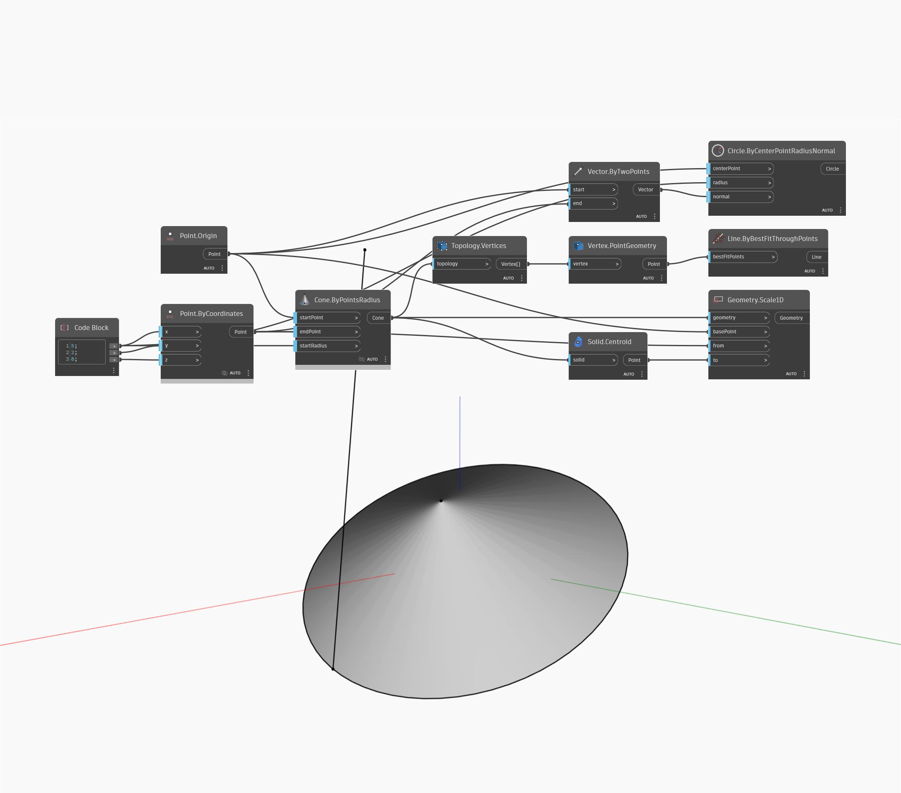

## Informacje szczegółowe
Węzeł Geometry Scale1D skaluje geometrię w jednym kierunku na podstawie punktu bazowego i dwóch punktów odniesienia. W pliku przykładowym skalowany jest stożek od jego punktu końcowego do jego środka ciężkości w odniesieniu do jego punktu początkowego. Pierwotne krawędzie stożka narysowano jako odniesienie wizualne.
___
## Plik przykładowy

