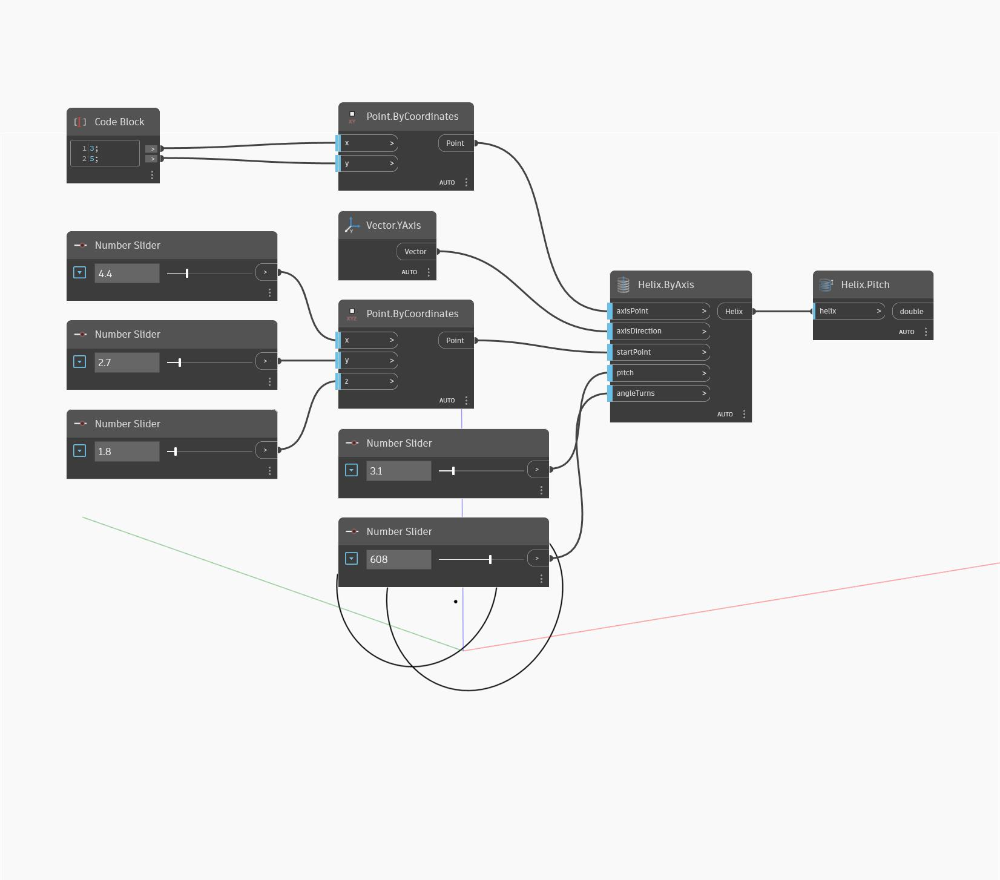

## Informacje szczegółowe
Węzeł Pitch zwraca odległość liniową wzdłuż kierunku osi, na którą rozciąga się helisa (helix) w jednym pełnym obrocie (360 stopni). W poniższym przykładzie tworzymy helisę za pomocą węzła Helix by Axis, a następnie za pomocą węzła Pitch znajdujemy skok helisy.
___
## Plik przykładowy

