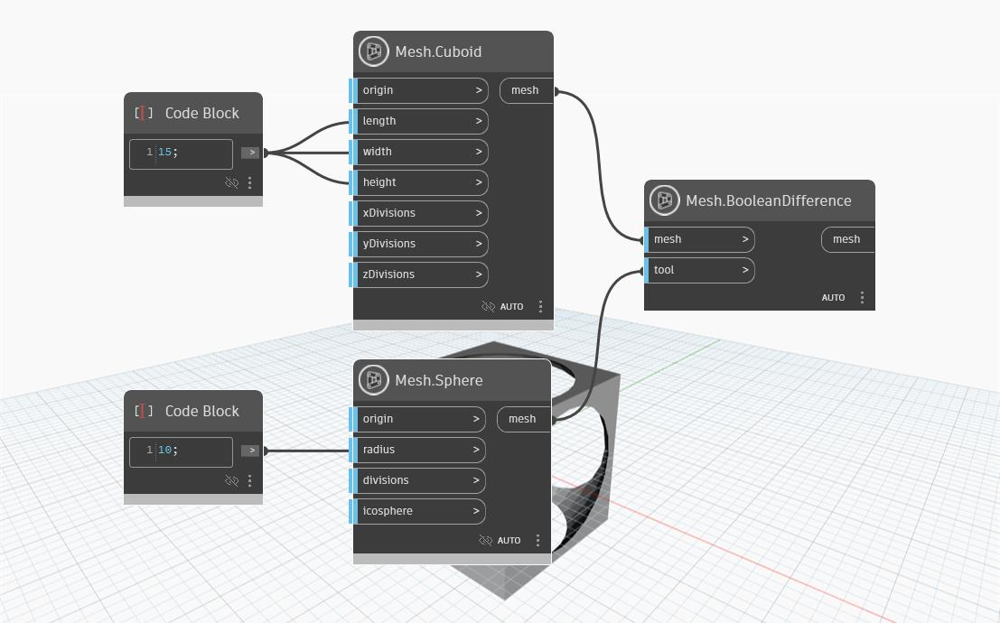

## Informacje szczegółowe
Jako dane wejściowe węzeł `Mesh.BooleanDifference` pobiera siatkę docelową i siatkę narzędzia. Ten węzeł oblicza różnicę logiczną przez wyeliminowanie nakładania się siatki narzędzia i siatki docelowej z siatki docelowej.
W poniższym przykładzie węzeł `Mesh.BooleanDifference` odejmuje element `Mesh.Sphere` od elementu `Mesh.Cuboid`.

## Plik przykładowy

