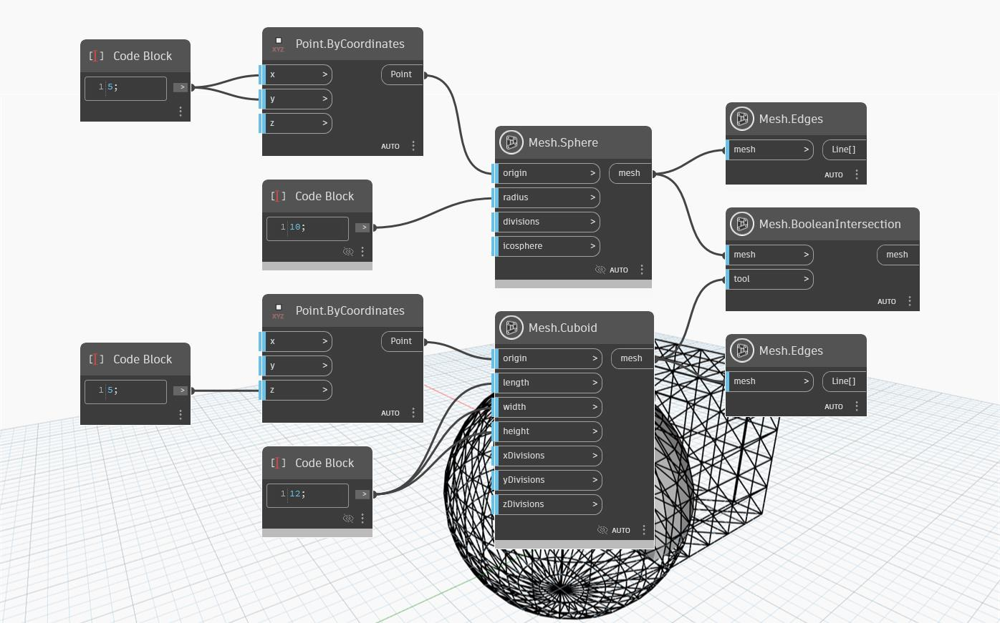

## Informacje szczegółowe
Operacja `Mesh.BooleanIntersection` pobiera jako dane wejściowe siatkę docelową oraz siatkę narzędzia i zwraca tylko tę część tych dwóch siatek, w której się one przecinają. W poniższym przykładzie węzeł `Mesh.BooleanIntersection` zwraca siatkę będącą wynikiem przecinania się prostopadłościanu i sfery.

(Węzły `Mesh.Edges` służą do wizualizacji geometrii siatki pierwotnej i siatki narzędzia).

## Plik przykładowy

