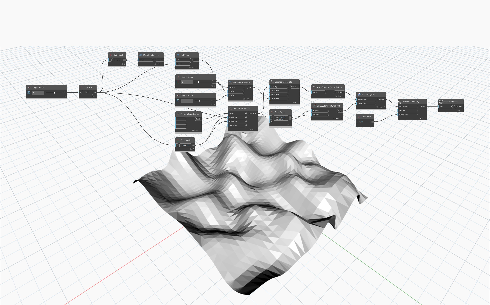

## Informacje szczegółowe
Węzeł `Mesh.ByGeometry` pobiera jako dane wejściowe obiekty geometrii dodatku Dynamo (powierzchnie lub bryły) i przekształca je w siatkę. Punkty i krzywe nie mają reprezentacji w postaci siatki, więc nie są prawidłowymi danymi wejściowymi. Rozdzielczością siatki utworzonej w wyniku przekształcenia sterują dwie wartości wejściowe — `tolerance` i `maxGridLines`. Pozycja danych wejściowych `tolerance` określa dopuszczalne odchylenie siatki od geometrii pierwotnej i zależy od rozmiaru siatki. Jeśli ta wartość jest ustawiona na -1, dodatek Dynamo wybiera rozsądną tolerancję. Pozycja danych wejściowych `maxGridLines` ustawia maksymalną liczbę linii siatki w kierunkach U i V. Większa liczba linii siatki pomaga zwiększyć gładkość tesselacji.

## Plik przykładowy

